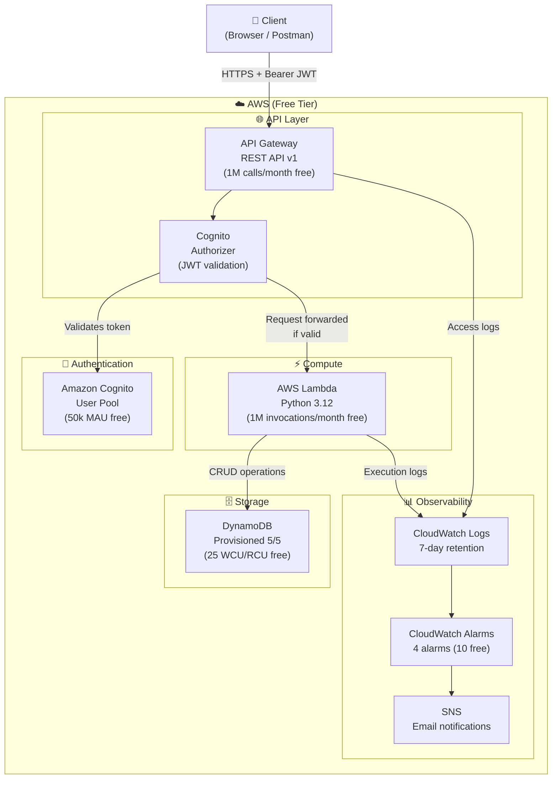

# aws-serverless-api-terraform

[](https://www.credly.com/org/hashicorp/badge/hashicorp-certified-terraform-associate-003)
[](https://github.com/YOUR_GITHUB_USERNAME/aws-serverless-api-terraform/actions/workflows/pr-checks.yml)
[](https://github.com/YOUR_GITHUB_USERNAME/aws-serverless-api-terraform/actions/workflows/merge-plan.yml)
[](https://aws.amazon.com/free/)
[](LICENSE)

> API REST serverless déployée sur AWS avec Terraform. Architecture production-grade,
> coût $0/mois sur le Free Tier AWS.

---

## Architecture



### Flux d'une requête API

```
Client ──HTTPS──► API Gateway ──JWT check──► Cognito Authorizer
                                                      │
                                              ✓ Token valid
                                                      │
                                              ► Lambda (Python)
                                                      │
                                              ► DynamoDB (CRUD)
                                                      │
                                              ◄ JSON Response
```

---

## Routes API

| Méthode | Route          | Description          | Auth     |
|---------|----------------|----------------------|----------|
| GET     | `/items`       | Liste tous les items | JWT      |
| POST    | `/items`       | Crée un item         | JWT      |
| GET     | `/items/{id}`  | Récupère un item     | JWT      |
| PUT     | `/items/{id}`  | Met à jour un item   | JWT      |
| DELETE  | `/items/{id}`  | Supprime un item     | JWT      |

---

## Coût estimé : $0/mois

| Service       | Free Tier                          | Usage estimé       | Coût    |
|---------------|------------------------------------|--------------------|---------|
| Lambda        | 1M invocations + 400k GB-sec/mois  | < 100k invocations | **$0**  |
| API Gateway   | 1M appels/mois (12 mois)           | < 100k appels      | **$0**  |
| DynamoDB      | 25 WCU + 25 RCU + 25 GB (always)  | 5/5 provisionnés   | **$0**  |
| Cognito       | 50 000 MAU (always free)           | < 100 utilisateurs | **$0**  |
| CloudWatch    | 10 alarms + métriques incluses     | 4 alarms           | **$0**  |
| S3 (state)    | 5 GB + 20k requêtes (12 mois)     | < 1 MB             | **$0**  |
| **Total**     |                                    |                    | **$0**  |

> ⚠️ Les limites Free Tier sont par compte AWS. Vérifie ta consommation dans AWS Cost Explorer.

---

## Structure du projet

```
aws-serverless-api-terraform/
├── modules/
│   ├── lambda/          # Fonction Lambda + IAM least-privilege
│   ├── api-gateway/     # REST API + Cognito authorizer + throttling
│   ├── dynamodb/        # Table DynamoDB provisionnée (Free Tier safe)
│   ├── cognito/         # User Pool + Hosted UI
│   └── monitoring/      # CloudWatch alarms + SNS notifications
├── environments/
│   ├── dev/             # ← Déploiement réel ici
│   ├── staging/         # Plan only
│   └── prod/            # Plan only, JAMAIS apply en CI/CD
├── lambda_src/
│   └── handler.py       # API CRUD Python 3.12
├── .github/workflows/
│   ├── pr-checks.yml    # fmt → validate → tflint → checkov → plan
│   └── merge-plan.yml   # plan sur tous les envs après merge
├── bootstrap/           # Crée le bucket S3 du Terraform state
└── tests/
    └── validate.sh      # Validation locale
```

---

## Déploiement

### Prérequis

- [Terraform](https://developer.hashicorp.com/terraform/downloads) >= 1.7
- [AWS CLI](https://aws.amazon.com/cli/) configuré (`aws configure`)
- Python 3.12 (pour le développement local)

### Étape 1 — Bootstrap (une seule fois)

Crée le bucket S3 et la table DynamoDB pour le Terraform remote state :

```bash
cd bootstrap/
terraform init
terraform apply -var="project=serverless-api"

# Note les outputs :
# state_bucket_name = "serverless-api-terraform-state-a1b2c3d4"
# lock_table_name   = "serverless-api-terraform-locks"
```

Mets à jour `environments/dev/backend.tf` avec les valeurs affichées :

```hcl
backend "s3" {
  bucket         = "serverless-api-terraform-state-a1b2c3d4"  # ← remplace
  dynamodb_table = "serverless-api-terraform-locks"            # ← remplace
  ...
}
```

### Étape 2 — Configurer les variables

Édite `environments/dev/terraform.tfvars` :

```hcl
aws_region = "us-east-1"
project    = "serverless-api"
owner      = "ton-nom"
```

### Étape 3 — Déployer dev

```bash
cd environments/dev/

# Initialise Terraform (télécharge providers, configure le backend S3)
terraform init

# Voir les changements prévus SANS modifier AWS
terraform plan

# Déployer réellement
terraform apply
```

Après le `apply`, les outputs affichent l'URL de l'API :

```
api_invoke_url       = "https://xxxxx.execute-api.us-east-1.amazonaws.com/dev"
cognito_hosted_ui_url = "https://serverless-api-dev-auth.auth.us-east-1.amazoncognito.com"
cognito_client_id    = "xxxxxxxxxxxxxxxxxxxxxxxxxx"
```

### Étape 4 — Tester l'API

1. **Crée un compte** sur la Hosted UI Cognito (output `cognito_hosted_ui_url`)
2. **Récupère un token JWT** :

```bash
# Via AWS CLI
aws cognito-idp initiate-auth \
  --auth-flow USER_PASSWORD_AUTH \
  --auth-parameters USERNAME=ton-email@exemple.com,PASSWORD=TonMotDePasse \
  --client-id <cognito_client_id>
```

3. **Appelle l'API** :

```bash
# Variable
API_URL="https://xxxxx.execute-api.us-east-1.amazonaws.com/dev"
TOKEN="eyJhbGciO..."  # Token JWT récupéré ci-dessus

# Créer un item
curl -X POST "${API_URL}/items" \
  -H "Authorization: ${TOKEN}" \
  -H "Content-Type: application/json" \
  -d '{"name": "Mon premier item", "description": "Test"}'

# Lister les items
curl -X GET "${API_URL}/items" \
  -H "Authorization: ${TOKEN}"
```

### Détruire l'infrastructure

```bash
# Toujours vérifier avant de détruire
terraform plan -destroy

# Détruire dev (gratuit de toute façon, mais bon)
terraform destroy
```

---

## CI/CD GitHub Actions

### Secrets à configurer

Dans GitHub : Settings → Secrets and variables → Actions

| Secret                  | Description                         |
|-------------------------|-------------------------------------|
| `AWS_ACCESS_KEY_ID`     | Clé d'accès AWS pour le CI/CD       |
| `AWS_SECRET_ACCESS_KEY` | Clé secrète AWS                     |
| `AWS_REGION`            | Région AWS (ex: `us-east-1`)        |

### Pipeline

```
PR ouverte :
  fmt -check → validate → tflint → checkov → plan (dev)
                                                   └─ Commentaire automatique sur la PR

Merge vers main :
  plan (dev) + plan (staging) + plan (prod)
  └─ Plans sauvegardés comme GitHub Artifacts
  └─ Jamais d'apply automatique
```

---

## Live Demo

> 📸 Screenshot de l'API en action :


*Pour ajouter ton screenshot : déploie l'environnement dev, fais un appel API avec Postman,
fais un screenshot et sauvegarde-le dans `docs/demo-placeholder.png`.*

---

## Décisions d'architecture

| Décision | Choix | Raison |
|----------|-------|--------|
| API style | REST v1 (vs HTTP v2) | Plus de features : usage plans, API keys, WAF |
| DynamoDB billing | PROVISIONED (vs PAY_PER_REQUEST) | Always-free tier : 25 WCU/RCU provisionnés |
| Lambda package | ZIP local (vs ECR) | Plus simple pour le Free Tier, pas de coût ECR |
| IAM | Custom policies (vs managed) | Moindre privilège réel — pas de `*` sur les resources |
| Tracing | PassThrough (vs X-Ray Active) | X-Ray Active coûte ~$5/million traces |
| KMS | AWS_OWNED_KMS (vs Customer CMK) | CMK = $1/mois — AES256 AWS géré = gratuit |

---

## Terraform Associate — Concepts démontrés

- **Modules** : architecture modulaire réutilisable
- **Variables & Outputs** : interface propre entre modules
- **`count` meta-argument** : ressources conditionnelles (policies IAM DynamoDB)
- **`depends_on`** : gestion explicite des dépendances
- **`lifecycle`** : `create_before_destroy` sur les deployments API Gateway
- **Data sources** : `aws_iam_policy_document`, `archive_file`, `aws_region`
- **Remote State** : backend S3 + DynamoDB locking
- **Workspaces** : 3 environnements indépendants (dev/staging/prod)
- **`dynamic` blocks** : attributs DynamoDB, GSIs
- **`validation`** : contraintes sur les variables
- **`sensitive`** : protection des outputs sensibles
- **Tagging strategy** : `default_tags` au niveau provider + tags par module

---

## License

MIT
